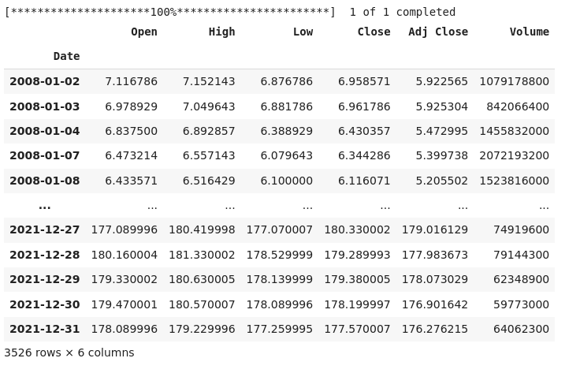
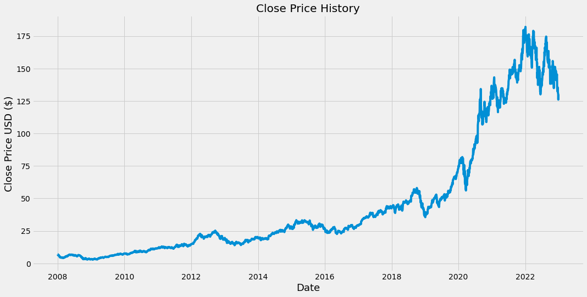
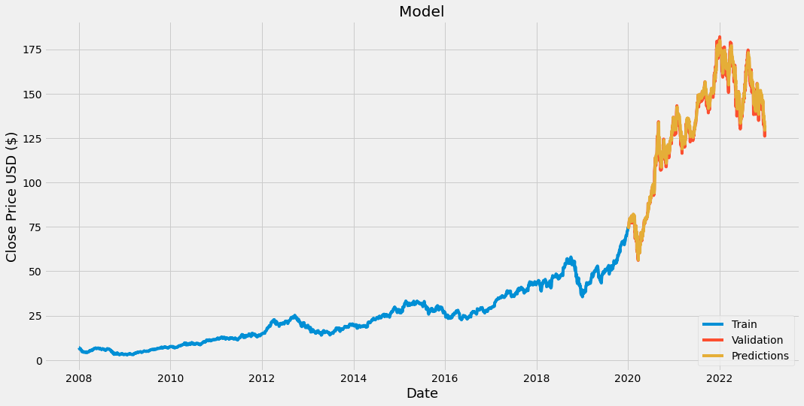
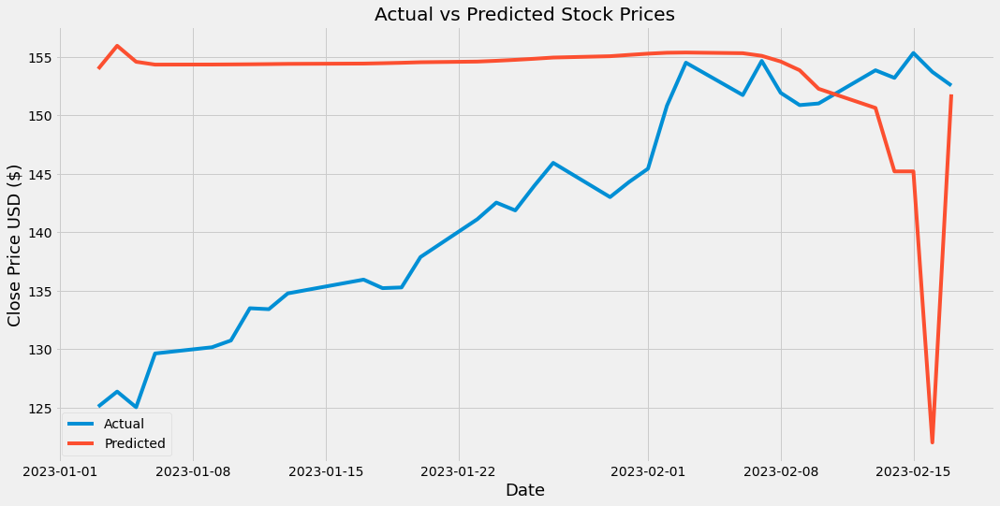

# Stock Prices Prediction Using LSTM

## Introduction

### Problem

Predicting stock prices is a challenging problem in the financial industry, which requires forecasting the future prices of stocks based on various factors and past price movements. Accurate predictions of stock prices play a critical role in investors' decisions and can impact the overall stock market. In this project, an LSTM model was chosen for stock price prediction due to its ability to capture complex dependencies and patterns in time-series data, such as stock prices, by remembering and utilizing information from previous time steps. This is particularly useful for stock price prediction as stock prices are highly influenced by past prices and trends.

### Literature review with links (another solutions)

The prediction of stock prices has been approached in various ways, ranging from traditional time series analysis methods such as ARIMA and TBAT to advanced deep learning models such as autoencoder neural networks (ANN) and long short-term memory (LSTM) networks. During my work on this project, I consulted several articles on this topic, including the following:

- ["Stock Market Predictions with LSTM in Python"](https://www.datacamp.com/tutorial/lstm-python-stock-market)

    - This article discusses the use of LSTM networks in predicting time series steps and sequences for stock market data. It employs the Keras Python package to build the LSTM model and includes examples using both sine wave and real stock market data.

- ["Research of Stock Price Prediction Based on PCA-LSTM Model"](https://iopscience.iop.org/article/10.1088/1757-899X/790/1/012109/pdf)

    - In this paper, the authors propose a deep learning model that integrates PCA and LSTM to predict stock price fluctuations. The stock trading information is based on time series, and LSTM is utilized to learn long observation sequences, making it a suitable choice for stock price prediction.

- ["Time-Series Forecasting: Predicting Stock Prices Using An LSTM Model"](https://towardsdatascience.com/lstm-time-series-forecasting-predicting-stock-prices-using-an-lstm-model-6223e9644a2f)

    - This post introduces time-series forecasting models that can predict future values based on previously observed values. The author of the article says that while there have been attempts to predict stock prices using time series analysis algorithms, these methods cannot be used to place bets in the real market. This article is intended for educational purposes only and does not encourage or promote any kind of financial investment in the stock market.

### Current work (description of the work)

The focus of this project is to learn to use and utilize LSTM networks for stock price prediction. LSTM is a type of recurrent neural network that is capable of learning long-term dependencies in time-series data. The project involves training an LSTM model on historical stock price data to predict future stock prices. However, it should be noted that the current work does not take into account stock headlines or news, and only relies on past price data for making predictions.

## Data and Methods

### Information about the data (probably analysis of the data with some visualisations)

The project is based on historical stock price data for the AAPL (Apple) company from January 2008 to January 2022, which was obtained from yahoo finance. The dataset consists of various attributes such as opening price (Open), highest price (High), lowest price (Low), closing price (Close), adjusted closing price (Adj Close), and trading volume (Volume). Before training the model, the data was preprocessed by scaling the closing prices using MinMaxScaler and splitting the data into training and testing datasets. It is important to note that the data source can be easily replaced with a new CSV file that contains a "Close" header, making the project more adaptable to various data sources.

### Description of the ML models you used with some theory

An LSTM model was used for predicting future stock prices due to its high suitability for time series prediction tasks, especially for predicting stock prices. The key advantage of LSTMs is their ability to capture long-term dependencies and patterns in sequential data, such as stock prices that can exhibit complex and non-linear relationships over time.

LSTMs achieve this by using an internal memory mechanism that allows them to selectively remember or forget previous inputs, depending on their importance to the current output. This memory mechanism is composed of three gates: an input gate, an output gate, and a forget gate. The input gate determines how much of the new input should be added to the memory, the output gate determines how much of the memory should be output to the current output, and the forget gate determines how much of the previous memory should be retained or forgotten.

This mechanism helps LSTMs avoid the vanishing gradient problem that can occur when training deep neural networks with RNNs and allows them to capture longer-term dependencies than traditional RNNs. Additionally, LSTMs can handle variable-length input sequences, which is particularly useful in stock price prediction, where the length of historical data used as input can vary depending on the length of the prediction horizon.

## Results

### Results with tables, pictures and interesting numbers

The LSTM model performed well in predicting future stock prices, achieving an RMSE of 3.1 on the testing dataset. This indicates that the model was effective in capturing the complex and non-linear relationships in the stock market. The model was able to accurately predict the long-term trend of the stock prices, including the peaks and valleys, but it had difficulty predicting sudden jumps and surges in the short term.

To visualize the model's performance, two pictures are provided. The first picture displays the predicted stock prices for the test dataset, which have already occurred, and compares them to the actual stock prices. The second picture shows the model's predicted stock prices for the future, which have not yet occurred at the time of writing this text.

Generally, the LSTM model's performance in predicting future stock prices was satisfactory, but there is still room for improvement, especially in predicting sudden changes in the short term.

## Discussion

### Critical review of results

While the LSTM model exhibited promising results in predicting stock prices, it's important to acknowledge the complexity of the problem at hand. Stock prices are subject to a wide range of factors, including geopolitical events, economic fluctuations, and company-specific news, which are notoriously difficult to predict accurately.

Additionally, it's crucial to remember that stock trading comes with inherent risks, and predictions should be viewed as guidance rather than guarantees. While an RMSE of 3.1 is considered good in many contexts, it may not be adequate for stock trading, which requires a higher degree of precision.

Therefore, it's essential to strive for continuous improvement in the model's accuracy to ensure its usefulness in the stock market. Nonetheless, the LSTM's ability to capture complex patterns and dependencies in time-series data makes it a valuable tool in predicting stock prices.

### Next steps

The next steps for this project involve further enhancing the accuracy of the LSTM model. One approach is to incorporate additional features such as news sentiment analysis and market volatility, which can help capture more complex patterns in the stock market. Additionally, combining other deep learning models such as convolutional neural networks (CNN) and transformers may help improve the overall performance of the model.

Another potential improvement is to test different hyperparameters such as the number of units in a dense layer, dropout rate, decay rate, and learning rate to optimize the model's performance. Fine-tuning the model architecture and adjusting the training process can also help in improving the accuracy and robustness of the model.

---

### Resources I've used

- ["Stock Market Predictions with LSTM in Python"](https://www.datacamp.com/tutorial/lstm-python-stock-market)

- ["Research of Stock Price Prediction Based on PCA-LSTM Model"](https://iopscience.iop.org/article/10.1088/1757-899X/790/1/012109/pdf)

- ["Time-Series Forecasting: Predicting Stock Prices Using An LSTM Model"](https://towardsdatascience.com/lstm-time-series-forecasting-predicting-stock-prices-using-an-lstm-model-6223e9644a2f)

- ["Recurrent Neural Networks (RNNs), Clearly Explained!!!"](https://youtu.be/AsNTP8Kwu80)

- ["Long Short-Term Memory (LSTM), Clearly Explained"](https://youtu.be/YCzL96nL7j0)